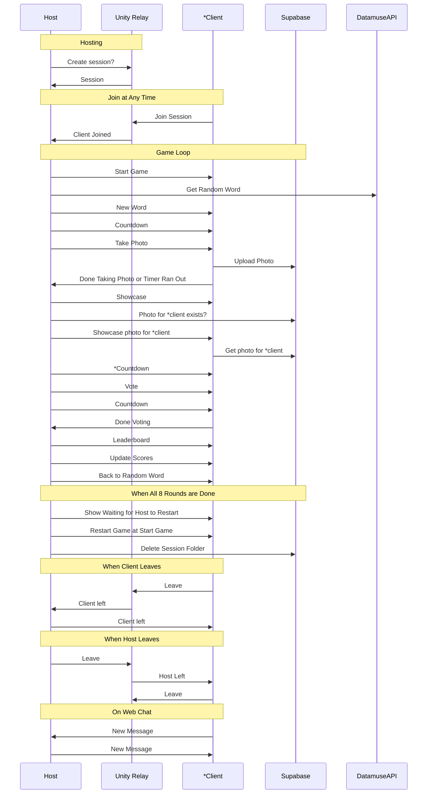

# Sistemas de Redes para Jogos - Final Project Report

## GarPic

## Student

- Mariana de Oliveira Martins, a22302203.

### Link to Repository

<https://github.com/notCroptu/GarPic>

### Link to Build

<https://drive.google.com/drive/folders/1h_RgIsq1xPjykGQ8UPjZt4rqc_8HsC60?usp=sharing>

## **Report**

### Project Description

**GarPic** is a multiplayer mobile game where players take photos to visually represent secret words. In each round, all players receive the same word and must take a photo within a short time limit, if a player physically moves in the real world (with GPS), their timer is paused until they stop again, to encourage exploration.

Once all photos are submitted, players vote on which best represents the word and points are awarded based on votes, the number of rounds is based on the number of players, and a leaderboard is presented at the end of each session.

---

### Tech Decisions and Possibility Research

The project will use `UnityNetcode` for GameObjects to handle multiplayer communication, roles, points...

With a modular setup that supports LAN and Unity Relay hosting as taught in class to have private game sessions.

Creating this project for mobile would be the most feasible version of the game due to the need for free movement and use of a camera and GPS, but user given permission will also need to be given to the game and will be something else to explore later on.

#### Large Packets

To have a mobile version of the game, we would need a way to handle PNGs in the game.

To capture them is the simpler part, as we can use Unity's WebCamTexture to ask for camera feed. To send them from client to client however, we would need a way to handle large packets of data, for that the tool `UnityWebRequest` was found, used to upload images like the ones in the project to an external cloud, and then returning a link that can be passed to other clients using UnityNetcode for GameObjects.

[Unity Web Request](https://docs.unity3d.com/ScriptReference/Networking.UnityWebRequest.html)

#### Unity WebGL

Using WebGL was also considered, as it would people to play without requiring them to install anything, and while it would still need permission to access camera and gallery, it could potentially run on more platforms and devices.

However, capturing or selecting photos in a browser would require custom JavaScript to access the camera or gallery and convert the result into PNGs that could be uploaded using `UnityWebRequest`, and `UnityNetcode` for GameObjects cannot be used in `WebGL` builds, so multiplayer communication would need to rely on `WebSocket (Unity plugin).

[WebSocket Unity Plugin](https://github.com/endel/NativeWebSocket)

Testing the browser version would also be more complicated, as it would require uploading to an external host (GitHub or itch.io) rather than testing directly in the Unity Editor or local builds.

While the accessibility of a no-install was great, the limitations were too great for that single benefit, and as a result, the Unity Mobile version was chosen as the more practical option for development.

### Server Functions

The game would need to keep track of:

- The room or lobby of players;
- The round’s correct word;
- The image submitted by each player;
- Player scores;
- Broadcast messages;
- Rounds (What things need to be shown, images, votes, photo taking period);
- GPS movement (is moving or not, no need for location to be passed).

---

### **Mobile Testing**

For testing and debugging mobile input and gameplay during development, I first installed Unity Remote 5 on an Android device.

This video should explain the process:

But otherwise the exact requirements would be:

- On an Android device running on Android 5.0 or later
  - **Unity Remote 5** app installed from the [Google Play Store](https://play.google.com/store/apps/details?id=com.unity3d.mobileremote)
  - **Developer Mode** enabled:
    - Go to *Settings > About phone* and tap the Build number seven times ( also MIUI number or OS number)
  - **USB Debugging** enabled:
    - Go to *Settings > System > Developer options* and enable *USB debugging*
  - **USB Data Transfer** enabled:
    - USB cable capable of data transfer
  - These **Unity Modules**:
    - Android Build Support
    - Android SDK & NDK Tools
    - OpenJDK

In Unity, in Editor Project Settings it would also be necessary for Device to be set to *"Any Android Device"*.

After this, on connecting the Android phone via USB to the computer running the Unity Editor allows the game view to stream directly to the device using Unity Remote 5.

#### Build, Install and Launch (.bat)

However, this setup only serves a way to debug input and rendering, and wouldn't reflect the device performance since it's still running from the editor, and some device inputs might still need to be built onto a mobile phone to reliably test them.

[Unity Remote 5](https://docs.unity3d.com/Manual/UnityRemote5.html)

For that reason, and to later use for testing in several phones at the same time, I had to create a Windows batch (.bat) script that would, after building, allow me to send an APK, install it, and run it on all USB Debugging connected devices to the PC.

ADB (Android Debug Bridge) came with the Unity Android Modules, though the adb short cut was not working even after inserting it into the PC Environment Variables, so for the script to work, one would need to install the unity module for the version used in the project (6000.0.30f1) or install ADB some other way and correct the path to adb.exe inside the .bat file.

[Android Debug Bridge](https://developer.android.com/tools/adb#install)

A recurring problem was the automatization of this for multiple devices at the same time, as when there are multiple devices connected we need to specify which one to apply commands to, or it may cause `adb.exe: more than one device/emulator`.

This and the fact that batch does not include loop breaks or threading and GOTOs are tricky in loops and made the recessivity a bit hard to handle.

The script logic goes as follows:

- The script first uses `adb devices` to list all connected devices (USB).
- Loops through each found serial number.
- Runs connect/install/launch commands on specified targets.
- Disconnects all previous connections for cleanup.

> **Note:** It works the best with a strong internet connection.

After this, I substituted the build and launch logic in `NetworkSetup` to use the .bad for launch on any connected phone.

#### Debugging

To debug builds on mobile, I just needed to once again use adb to start a `logcat` while the phone is connected with udb debugging like described here:

[Unity Discussions - How to use adb logcat?](https://discussions.unity.com/t/how-to-use-adb-logcat/75785/2)

The command for cmd would look like this:

`"C:\Program Files\Unity\Hub\Editor\6000.0.30f1\Editor\Data\PlaybackEngines\AndroidPlayer\SDK\platform-tools\adb.exe" logcat -s Unity`

#### Permissions

An example oif permissions necessary for the project would be the counter that is stopped when the player is moving, for which we need GPS, which is accessible using Unity's Location Services, for which the (Old) Input system already provides a variable of `Input.location`.

[Unity Documentation - LocationService](https://docs.unity3d.com/6000.1/Documentation/ScriptReference/LocationService.html)

Even then the Input.location variable needed to be set up and for that I had to search how to correctly use it, as some features ike permissions vary between devices.

Even with this variable, setup is required, which can vary significantly between devices and platforms. I referenced this Medium article to correctly initialize GPS at start, using coroutines:

[Medium - How to Access GPS Location in Unity](https://nosuchstudio.medium.com/how-to-access-gps-location-in-unity-521f1371a7e3)

Location Services operate asynchronously, so it’s important to run them in parallel with the main thread, and to update the GPS status whenever the player changes permissions.

During testing on different devices, I noticed inconsistencies with GPS activation and considered creating a custom Android Manifest before building, to make sure permissions were required at before even launching. However, while it is possible to achieve this by placing the manifest in the correct folder hierarchy and setting it up to match build preferences, managing the manifest file can be complex and may cause the app to become uninstallable on some devices as I learned, because of the dynamic nature of Unity builds (that build the Manifest according to script necessities), led me to prefer runtime permission requests for now.

[Android App Manifest Documentation](https://docs.unity3d.com/Manual//android-manifest.html)

On Android it's supposed to request location permission on app launch, and wait until it is granted to add the stop timer feature.

If enabled, the game then periodically checks for GPS movement by comparing longitude and latitude of the GPS last placements, stopping the timer if there is a significant delta.

Though this location may not always be correctly reflected by the phone, and may cause jitters that falsy affect this delta, so for this we would need to test different values of Accuracy In Meters and Distance In Meters inserted at `Input.location.Start(x, y)` for better accuracy.

The .bat file for build was very helpful in testing the previous process, as when testing with Unity Remote, the device does stream GPS, but the Editor’s own permissions can cause `Input.location.isEnabledByUser` to return false even when location is enabled on the host device.

[Stack Overflow - Input.LocationService.isEnabledByUser returning false with Unity Remote in the Editor](https://stackoverflow.com/questions/45340418/input-locationservice-isenabledbyuser-returning-false-with-unity-remote-in-the-e)

For that reason we must build on android and to make sure permissions for location are enabled.

Although it is also necessary to ask for permissions for the Camera, as both GPS and Camera permissions are considered dangerous, it is a lot less hazardous as you don't need to verify any camera services, so the only thing we must do is call `Application.RequestUserAuthorization` at runtime. The documentation came with the correct implementation but I chose follow the one I already had:

[Unity Documentation - WebCamTexture](https://docs.unity3d.com/ScriptReference/WebCamTexture.html)

---

### **UnityWebRequest**

Unity Web Request proved to be useful for more than sending camera data, as I wanted players to get unexpected words rather than ones I preset from my own list so I explored using online APIs for which I found UnityWebRequest to be useful.

#### Random Word API

My first attempt used [Random Word API](https://random-word-api.herokuapp.com/word), as it was very simple to integrate and returned a new word every time. However, the words were often too technical, too weird even for the unexpectedness I was hoping for, and worried it would end up messing up the experience (like rare scientific names).

So looking for more control, I discovered the [Datamuse API](https://www.datamuse.com/api/), which lets you specify restrictions in the URL so you can even find words that fit certain meaning, spelling, sound, vocabulary and even theme. This also opened up the possibility to later let me give players the liberty to choose their own theme to bias word selection towards what they were feeling like.

To integrate this into Unity, more specifically in the `WordSelection` script, I first created a list of topics, that would be search using the APIs `topics` query, though I later learned not all words in this query yield results, and had to move to a more stable query, though less appropriate `rel_jja`, that searches words relating to a given noun, essentially it results in more descriptive words based on that noun, instead of directly relating to a given topic.

> **Note:** This might not have been a good API to use later on, as it has a maximum of 100,000 requests per day. (For example, with an average of 8 rounds per session and approximately 80,000 sessions per day (based on Gartic statistics during the pandemic), you could need up to 640,000 requests per day, plus, multiple requests might be needed per round if Word Selection fails.)

#### Data Retrieval

With a list of topics set, I used `UnityWebRequest` to call a custom Datamuse url from a random topic, which was easy to learn as all the code needed was exemplified in the *OLD* official page [official documentation](https://docs.unity3d.com/540/Documentation/Manual/UnityWebRequest).

Basically, you create a new `UnityWebRequest`, input a source URL from which it will get data (`UnityWebRequest www = UnityWebRequest.Get("url"`) and wait for it to return a result inside a coroutine, where upon completion you can check for success and choose to try again.

The coroutine part worked well with my setup as I had already decided to have a Game Loop based on coroutines.

If successful, the `UnityWebRequest` handler will contain any data retrieved from the webpage (in my case, only the text, which is JSON as most word APIs return), and I then only needed to parse the returned JSON response to extract the first word.

#### Data Sending

For camera implementation with `UnityWebRequest`, I needed my own database solution for storing images. I chose Supabase, recommended by a friend for being more affordable , performant, and for offering authentication support.

The implementation for sending images using `UnityWebRequest` was similar to sending packets in retrieving json data, but this time I had to choose between HTTP `PUT` and `POST` for uploading. I chose `PUT` because it is used to upload or replace a resource at a specific path and if the file does not exist, it creates a new one, and if it already exists, it overwrites it. `POST` is used for creating a new resource without specifying the path, which was not ideal for storing session and player specific data by their IDs.

[Supabase - http: RESTful Client](https://supabase.com/docs/guides/database/extensions/http)

When setting up Supabase, I created a storage bucket and was provided with the bucket URL, an anonymous key, and the bucket name, which are necessary to authenticate upload requests from the Unity client to Supabase storage.

The variables I created (`supabaseURL`, `supabaseANON`, `supabaseBUCKET`) are intended for the use of the client specifically, as connecting the client to the database (with a *connection string*) would compromise the database's security as it would give players my database credentials such as the password.

For `UnityWebRequest` to be able to handle the images through the clients without needing a deeper user authentication, I had to include policies to my Supabase bucket to allow anonymous access with the keys above for insert (upload) and select (read) operations in the bucket only.

This doesn't mean it will take more work later as I only need clients to be aware of the correct URL for uploads and downloads and use `UnityWebRequest` both for sending images and retrieving them later, so I don't need to have my own backend for this structure and therefore no need to use *connection strings*.

The client credentials however had to be put away in a json, hidden by GitIgnore in order to keep the project safe in the git. Therefore Supabase would only work in my own PC or builds I make.

---

### **Server Relay**

To make playing sessions similar to popular party games, with a session code, GarPic uses Unity Relay Servers using `UnityNetcode for GameObjects` learned through the implementation taught in class:

Relay servers, means that rather than hosting game worlds themselves, relay servers only provide the connections between players, which means they can serve many sessions at once, some relay servers like Steam's and PSN provide methods of authentication but we will only need anonymous users.

This approach came from the setup simplicity for players, a simple UI and private sessions for friends that are easily manageable with short codes using Cloud.Unity relay, as normal peer-to-peer networking suffers from firewall issues, and Unity Relay, like other relay services, solves this by keeping IPs between users safe:

[Unity Support - About Relay IPs, Ports and Firewall Considerations](https://support.unity.com/hc/en-us/articles/20152286417044-About-Relay-IPs-Ports-and-Firewall-Considerations)

#### Goals

On opening the app, players would be met with a join button, to join existing available sessions through a code, or a host button to create a new session. Sessions would have a max of 8 players, but players would be allowed to join at any time, keeping in mind the game would not be prolonged for their benefit.

When starting the game, players can either host a new session (generating a unique code) or join an existing session using a code shared by the host, sessions should handle up to 8 players and are open for joining until the game ends, but new players will join the ongoing game rather than restarting it for everyone.

#### Cloud.Unity

Firstly, I had to add the Relay service provided by Unity to the project through Unity Dashboard, which was easy, and the project was already registered in my account there.

Then, on editor I turned on Relay on `UnityTransport` and used the `NetworkSetup` script to save transport information such as if the client is server, and if it is hosted as relay, and what the session number is, which will be helpful for identifying photos in Supabase.

#### Server Setup

When entering the game, players have the option to host a session, which creates a new relay server where they can play.

Relay setup needs to be async, contrary to usual network workings, and had to be checked through a Task called Login, where an exception is run in case the Unity authentication services are not able to initialize and sign in.

Then another Task, `CreateAllocationData`, calls the service again to create a new session connection with a given max players (8 for GarPic), which I can then ask for session information, like the session code, and store it in the class `RelayHostData`.

Using one of the settings of the `RelayHostData` object, the allocation ID, I can call a final task `GetJoinCodeAsync`, to retrieve the session code for players to join with.

We run `StartHost()` to initialize the client as host and start relaying, and after this the player is sent into the game scene.

In the game scene, the host may wait for at least 3 players to join, after which they alone can start the game, and then the game loop logic is initialized and all clients synchronize to the main game scene.

#### Client Setup

Players who want to join a an existing session act as clients connect through the Unity Relay server using the session code provided by the host.

Upon inserting this code one the Join button on the lobby, the code is sent to the Relay service to find and join the correct allocation through the `JoinAllocationAsync` task.

Once allocated, we need to set client relay data for `UnityTransport` using `SetClientRelayData`. Once that's done we can't forget to `StartClient()`, and after that the client’s state the game state is ready to be auto synchronized with the host.

#### Error Handling

Errors are displayed to the viewer at runtime in case a connection is not established.

---

### **Netcode**

Since I didn’t need to synchronize transforms, I decided to use a single `NetworkObject` object that contains both the session manager and game loop logic, and serves as the central authority for all network communication.

Since I didn’t need to synchronize any transforms, I thought this choice was ideal, with the goal of reducing relay traffic by consolidating all network communication into one object instead of spreading it across multiple GameObjects with separate `NetworkObject` components, even if those had transform syncing disabled.

To start, I added the `NetworkObject` cat the top of my component list, as the unity documentation warns to do for proper execution order:

[Unity Netcode Docs - NetworkObject Component Order](https://docs-multiplayer.unity3d.com/netcode/current/basics/networkobject/#component-order)

---

#### Session Lobby

The session lobby is managed by the `SessionStart` script. At first, all players are displayed using their `clientId`, but each player can edit their nickname, which is then used throughout the game session.

Nicknames are shared across all players using a `NetworkList`, which is owned and modified only by the host. Clients cannot modify the list directly but must send a request to the host instead containing the nick string and their client ID.

At first, I had issues with the nickname list not being initialized properly. Even though I was assigning it in `Awake()`, I kept getting null reference errors and `OnListChanged` was not firing. After some research and testing, I realized that this was happening because `Start()` was running before the `NetworkObject` was fully initialized, and as a result of initializing the list before `NetworkObject` it became null again when it finally searched for network variables to sync.

To fix this, I moved all network-related logic into one of `NetworkBehavior`s methods, `OnNetworkSpawn()`, that is guaranteed to run only after the network object is setup.

I found this behavior explained and confirmed in this video:

[Multiplayer Setup in Unity NGO - OnNetworkSpawn](https://youtu.be/YmUnXsOp_t0?si=Rhw4YgKmYYqXap2E&t=4587)

[Multiplayer Setup in Unity NGO - NetworkVariable](https://youtu.be/YmUnXsOp_t0?si=38MoRjY6DzF_RD0V&t=6374)

##### Scene Management

However, even after this, changes to the nickname list were still not being shared with other clients. I found the problem was that `SessionStart` was placed directly in the scene and not set to spawn like with dynamic network objects using `NetworkObject.Spawn()`, and because I was also switching scenes (from the lobby to the game), the object was not automatically registered and synced across clients.

[Unity Forum - Scene object with NetworkObject disappears on client](https://discussions.unity.com/t/scene-object-with-networkobject-disappears-on-client/939204)

So I enabled Scene Management in the `NetworkManager` and started using `NetworkManager.SceneManager.LoadScene()` to transition between scenes instead of directly with `SceneManager`, so it knows to find and synchronize scene spawned objects across all clients during scene loading.

##### Setting Nicks

Since I couldn’t rely on each client to detect new connections and add entries themselves as they could add each other multiple times, I first created a server RPC method, `SetNicknameServerRpc`, which theoretically would update the nickname associated with a given `clientId` when requested.

Each client has a confirm button tied to `UpdatePlayerNickname`, which sends this request to the server. Once the nickname is updated in the list, the `OnListChanged` event is triggered, which all clients listen to in order to refresh their UI.

However, I discovered that the server or host client can't call a Server RPC, but since I cannot allow clients to have write permission on the list directly, I had to separate `SetNicknameServerRpc` into `SetNickname` method so if the calling client is the server, it can skip RPC and directly modify the list. The new method is responsible for actually modifying the list and to invoke `OnListChanged` event, and notify all clients, while the `SetNicknameServerRpc` is now only used for regular clients to tell the server to use `SetNickname`.

Regardless of `ServerRpc` permissions, `ClientRpc` will still call all clients, including the host, which useful for telling clients to close their session lobby canvases when the game starts on the host's side.

---

#### Game Loop

The Game Loop controls the overall game state, so whether players are supposed to be taking pictures, voting, or viewing the leaderboard, this control must come from a single client. Logically, this responsibility is given to the server or host, who is also the only one allowed to start the game with session start's "Start Game" button.

Inside the `GameLoop` script, a main coroutine iterates over an array of `GameState`s for a set number of rounds, and both `GameLoop` and the individual `GameState` scripts are `NetworkBehaviour`s.

The goal is that each `GameState` holds `NetworkVariable`s and uses RPCs to trigger UI changes on clients while the main game logic runs on the host side within the coroutine, modifying those variables and calling RPCs manually to make sure all clients remain synchronized.

#### WordSelection

Word Selection is the first game state in the loop and includes a `NetworkVariable` for the word that players must take pictures of, and a timer value that tells players how long they have to prepare.

#### PhotoTaking

Since the photo taking phase involves only individual players capturing their own photos, there is no need for them to share information with each other during this state. Because of this, the server's only responsibility was to wait until all clients reported that they had finished taking a photo.

The timer for this phase is not enforced by the server, as it can vary between players due to the GPS timer feature, and seemed to be the best way of making sure each player has a fair and consistent timer duration.

To handle this, the server uses a `ClientRpc` called `ClientStateClientRpc` to instruct all clients to start their own photo taking coroutine that runs a countdown timer that can be interrupted by GPS conditions, and when it finishes, the client uploads the captured photo to the previously configured Supabase bucket.

After the upload, the client calls a `ServerRpc` named `ClientDoneServerRpc` to notify the server that it has completed the task, upon which the server adds that client’s ID to a local `HashSet` of completed client IDs. The main game state coroutine, controlled by the server, continues to wait until all currently connected clients id's have been added to the `HashSet`.

Once a client finishes, it hides the state canvas and shows the player list UI from `Session Start` again, where the player can see other players' timers updating in real time.

After everyone's reports as finished, the server moves on to the next state.

##### GPSTimer

This real-time sync is handled using the `GPSTimer`, which I initially thought of using with a `NetworkList`  to hold corresponding clientIDs and Timers ulong, following the same implementation logic as `Session Start`'s nickname `NetworkList`.

However, I changed it to use a `NetworkVariable`, as I needed all clients to own their own timers, and sending ServerRPCs every second for 8 clients to server and then back to other clients just to store those already existing variables in a new list seemed unnecessary.

So using individual `NetworkVariable`s allowed me to let each player own and update their own timer value directly, without needing to send that `ServerRpc`, syncing only when the value changes, and avoiding other issues that might be associated with `NetworkList` indexing, to hopefully reduce the weight of this part of the network.

With this I also to created a separate viewer for it, `TimerDisplay` that would run inside the GameLoop scene spawned object, while `GPSTimer` became an instantiated `NetworkObject` in it's own prefab spawned by the server, so I would be able to use `FindObjectsByType()` to find the synchronized objects from which to collect the timer data.

#### Showcase

The Showcase phase handles the part of the game where, after all photos are submitted, each player’s photo is presented to everyone for a set period, along with their nickname, so all players see each valid entry before voting and have an opportunity to talk about it.

The photos are taken from the Supabase bucket, the server first requests a header to check if the photo url from a client was uploaded, and if so, it calls `UpdatePictureClientRpc` so that all clients get and display that specific image, along with the correct nickname from session start's `NetworkNickname` list

While the photo is being shown, a `NetworkVariable` timer counts down from 10 seconds for all clients to update their display at the same time using the shared value. After the countdown finishes, the showcase moves on to the next player’s photo and repeats the previous process for everyone.

Since this step is just for viewing and does not affect gameplay or voting, I chose to have the server control the timer for everyone. Even if a player has a slow connection and their image takes longer to appear, the game doesn't pause for them, to avoid making the entire group wait on one person’s network, which I felt would be more frustrating for a bigger number of players.

After the main coroutine is done, the server calls `DisableShowcaseClientRpc` to hide showcase UI on every client's screen.

#### Voting

The `Voting` phase begins after all players have submitted their photos for the round, which were previously saved in `Showcase`, and excluding their own photo, are asked to vote on which photo best represents the word for that round.

For each photo, the player's nickname and image are shown, along with a corresponding voting button that is set up by the client alone when the server calls the `SetUpPicturesClientRpc()` in the main coroutine. Once the client votes, the result and their own client ID is sent to the host using `VoteServerRpc()`, and the UI is disabled to prevent multiple votes from the same client.

Votes are tracked using a server side Dictionary, where the key is the client ID of the photo's author, and the value is a list of client IDs who voted for that photo.

A `NetworkVariable` timer is displayed, controlled by the server to make sure the process doesn't go on indefinitely, and once either all players have voted or the timer is out, the voting phase ends.

#### LeaderBoard

The Leaderboard phase shows the final score rankings to all players at the end of the game session, that are stored in a `NetworkList` of `NetworkScore` containing the clientId and their corresponding score. This list is updated by the server after the Voting phase concludes with points assigned both to the player who received the most votes and to the players who voted for them.

Clients receive a `ShowLeaderBoardClientRpc()` call that enables the UI, and a `DisableLeaderBoardClientRpc()` hides it again after a short delay unless it's the final round, so players remain viewing scores until host restarts. The leaderboard itself is updated whenever the scores `NetworkList` changes.

---

#### Resetting the Session

To allow players to replay the game without starting a new session, I had to reset the scores and tell Supabase to empty the session folder.

On the Unity side, I added a virtual `ResetValues()` method to the GameState abstract class, which is called by the GameLoop when restarting and is responsible for resetting all UI elements to their original `Start()` state and clearing persistent gameplay data such as player scores stored in the `NetworkList` used by the `Leaderboard`.

On the Supabase side, since storage is object based, the ideal approach would have been for `PhotoTaking` to tell the bucket to delete the entire folder containing the round’s images by submitting a single request with a list of all file paths inside it, but because of either Supabase policy restrictions or issues with the way my requests were formatted, the PUSH request for delete was not working as expected, and I had to send an individual DELETE request for each file inside the session folder, which was definitely not an ideal solution.

Once both the local game state and Supabase storage were reset, the game is started again.

#### Exit

When a player or host wants to quite the session, they may press the back button, which will open a panel to confirm exit action, when confirming with yes, a method `ExitToLobby()` is called, that uses `NetworkManager.Shutdown()` as client, and if it's the host `NetworkManager.Shutdown(true)` to remove player objects.

When a client disconnects, the `NetworkSetup` class checks if the `OnClientDisconnected(ulong clientId)` callback was triggered with their own client ID, and if it is, it returns that client to the lobby without affecting others.

However, if the host disconnects, the `NetworkManager` automatically triggers `OnClientDisconnected(ulong)` on each connected client, passing in each client's own ID, disconnecting every client to exit the session and return to the lobby.

---

#### WebChat

For the live chat I had the idea of using RPCs to send messages between clients but I wasn’t sure if this approach was appropriate for handling potentially uncontrolled input, such as users spamming messages, so I had to research for common implementations and found this:

[YouTube - Multiplayer Chat Using RPCs](https://www.youtube.com/watch?v=ATiBSj_KHv8)

The reason why I doubted this is because I had heard previously that NetworkManager had a live chat feature, but after confirming my ideas I moved on to implement it.

First I made a `SendMessageServerRpc()` to allow clients to send messages to the server, which would them to tell teh server to call `ReceiveMessageClientRpc()` to distribute the message, and let clients update their UI and get notified of a new message.

I also connected it to `StartSession`'s Add and Remove actions to that the server would send join and leave messages using each player's correct nickname.

---

### Analysis

#### Supabase

| Plan | Free $0/ month | Pro $25/ month | Team $599/ month | Enterprise |
| -------------- | ----- | ----- | ----------- | ----------- |
| Storage | 1 GB included | 100 GB included then $0.021 per GB | 100 GB included then $0.021 per GB | Custom |
| Bandwidth | 5 GB included | 250 GB included then $0.09 per GB | 250 GB included then $0.09 per GB | Custom |
| Pausing | After 1 week of inactivity | Never | Never | Never |

[Supabase - Pricing](https://supabase.com/pricing)

These limits are the most relevant for my project.

For Supabase, only uploads affect storage, while downloads and confirmations requests like delete affect bandwidth, because they are sending something back, though request's size is minimal, and deletions also help reduce storage usage.

The Free plan's auto pause after 1 week of inactivity could matter during development but in a commercial or frequently played game, the frequent requests would prevent the project from being paused.

##### Supabase Analysis

After testing, I reviewed my Supabase bucket and found typical image sizes such as:

- image/png - 131.1 KB
- image/png - 359.77 KB
- image/png - 388.69 KB
- image/png - 312.76 KB
- image/png - 323.83 KB
- image/png - 145.8 KB
- image/png - 332.2 KB
- image/png - 412.98 KB
- image/png - 349.59 KB
- image/png - 329.24 KB

So an image uploaded to my bucket would on average be ~310 KB and if we do the calculations for the ideal game of 8 players and 8 rounds:

- Storage (uploads):

  Each player uploads one image per round:

      8 players × 8 rounds × 310 KB = 19,840 KB ≈ 19.8 MB per game

- Bandwidth (downloads):

  Each player downloads 8 images per round:

      8 players × 8 rounds × 8 images × 310 KB = 158,720 KB ≈ 158.7 MB per game

- Bandwidth (image existence checks):

  The host checks for each image before display and we assume a 200 B confirmation response:

      8 players × 8 rounds × 1 check × 200 B = 12,800 B ≈ 12.8 KB per game

- Bandwidth (deletion confirmations):

  Assuming each image deletion returns a 200 B confirmation response:

      8 players × 8 rounds × 8 images × 200 B = 102,400 B ≈ 102.4 KB per game

Per game this would average to:

- Total storage impact per session: ~19.8 MB
- Total bandwidth impact per session: ~158.8 MB

Which means, that on the free plan I could have:

- (5,000 MB / 158.8 MB) 31 full games per month on bandwidth.
- (1,000 MB / 19.8 MB) ~50 games worth of images before reaching storage limit.

On the rest of the plans:

| Plan  | Monthly Cost | Bandwidth | Storage | Estimated Sessions/Storage |
| -------------- | ------------ | --------- | ------- | ---------------------------------------------------------- |
| Pro        | \$25         | 250 GB    | 100 GB  | 1574 games/month, ~5050 games worth of images |
| Team       | \$599        | 250 GB    | 100 GB  | Same as Pro, but includes options that are not necessary for my project |
| Enterprise | Custom       | Custom    | Custom  | Depends on negotiated limits |

So if necessary for commercial distribution of the game, I would get pro, but I wouldn't need anything beyond that unless the game unexpectedly took off.

---

#### Unity Relay

To analyze the game's Unity Relay bandwidth usage I downloaded the Unity Multiplayer Tools package, which comes with a NetworkObject bandwidth Module for the Profiler Tab.

Using that, I composed the summary bellow of the estimated bandwidth usage for one full round of the game:

| Game Phase | Type | Sent Bandwidth Cost | Received Bandwidth Cost | Times Performed |
| -------------- | ------------ | --------- | --------- | --------- |
| Start | Host start a Server | 17 Bytes | 0 Bytes | 1 |
| Start | Client join a Server | 310 Bytes + ( 5 Bytes * nClients ) | 178 Bytes | 7 |
| Start | Client Network Object GPSTimer | 100 Bytes *nClients | 64 Bytes | 7 |
| Start | Client timer Network Variable from Object GPSTimer | 50 Bytes *nClients | 0 Bytes | 7 |
| Start | Client Change nickname | 29 Bytes *nClients | 28 Bytes | *nTimes |
| Start | Host Change nickname | 29 Bytes *nClients | 0 Bytes | *nTimes |
| Constant | Time sync | 5 Bytes *nClients | 0 Bytes | Every 105 frames |
| Constant | Web Chat Message | 39-137 Bytes *nClients | 44-145 Bytes | *nTimes |
| Word Phase | Word Network Variable | 5 Bytes *nClients | 0 Bytes | 1 |
| Word Phase | Timer Network Variable | 5 Bytes *nClients | 0 Bytes | 11 |
| Photo Taking Phase | Enable Photo Taking | 9 Bytes *nClients | 0 Bytes | 1 |
| Photo Taking Phase | GPSTimer Update Network Variable | 15 Bytes | 15 Bytes *nClients | 20 *nClients |
| Photo Taking Phase | Client Confirm Done | 0 Bytes | 15 Bytes | *nClients  |
| Photo Taking Phase | Disable Photo Taking | 9 Bytes *nClients | 0 Bytes | 1 |
| ShowCase Phase  | Enable ShowCase | 9 Bytes *nClients | 0 Bytes | 1 |
| ShowCase Phase | Showcase *clients photo | 9 Bytes *nClients | 0 Bytes | *nClients  |
| ShowCase Phase | Timer Network Variable | 9 Bytes *nClients | 0 Bytes | *nClients *11 |
| ShowCase Phase | Disable ShowCase | 9 Bytes *nClients | 0 Bytes | 1 |
| Voting Phase  | Enable Voting | 9 Bytes *nClients | 0 Bytes | 1 |
| Voting Phase | Client Confirm Done | 0 Bytes | 16 Bytes | *nClients |
| Voting Phase | Disable Voting | 9 Bytes *nClients | 0 Bytes | 1 |
| Leaderboard Phase  | Enable Leaderboard | 9 Bytes *nClients | 0 Bytes | 1 |
| Leaderboard Phase | Update Scores | 54 Bytes *nClients | 0 Bytes | 1 |
| Leaderboard Phase  | Disable Leaderboard / Setup Restart | 9 Bytes *nClients | 0 Bytes | 1 |
| Restart | Restart Game | 9 Bytes *nClients | 0 Bytes | 1 |
| Restart | Reset Network Variables/Lists | 69 Bytes *nClients | 0 Bytes | 1 |
| End | Client quit a Server | 83 Bytes + 50 Bytes (update host network variables) + ( 3 Bytes * nClients ) | 0 Bytes | 7 |

For the ideal 8 round and 8 player game, where we suppose everyone always votes and takes a photo, changes nickname one time, and consider these values:

- *nClients = 7
- *n Frames = 960 seconds / (105 updates / 60 frames ) ≈ 550
- Average message size = 39-137 ≈ 88
- Average Messages sent = 50
- Average game time = 16min

We can calculate:

##### Sent Bandwidth Cost

| Event      | Calculations | Total |
|------------|--------------------|-----|
| Constant      | ( 5 Bytes × 7 ) × 550 frames + ( 88 Bytes × 7 ) × 50 messages | 50,050 Bytes |
| Word | ( 5 Bytes × 7 ) + ( 5 Bytes × 7 ) × 11 | 420 Bytes |
| PhotoTaking | ( 9 Bytes × 7 ) + 15 Bytes × 20 × 8 + ( 9 Bytes × 7 ) | 2,526 Bytes |
| ShowCase | (  9 Bytes × 7 ) + ( 9 Bytes × 7 ) × 7 + ( 9 Bytes × 7 ) × 7 × 11 + ( 9 Bytes × 7 ) | 5,418 Bytes |
| Voting | (  9 Bytes × 7 ) + ( 9 Bytes × 7 ) | 126 Bytes |
| Leaderboard | ( 9 Bytes × 7 ) + ( 54 Bytes × 7 ) + ( 9 Bytes × 7 ) | 504 Bytes |

**One Round Total Data**: 50,050 + 420 + 2,526 + 5,418 + 126 + 504 = **59,044 Bytes**
**8 Rounds Total Data**: 59,044 * 8 = **472,352 Bytes**

---

Then we add Start, End and Restart events one time:

| Event      | Calculations | Total |
|------------|--------------------|-----|
| Start      | 17 + ( 310 Bytes + ( 5 Bytes × 7 ) ) × 7 + ( 100 Bytes × 7 ) × 7 + ( 50 Bytes × 7 ) × 7 + ( 29 Bytes × 7 ) | 9,985 Bytes |
| Restart | ( 9 Bytes × 7 ) + ( 69 Bytes × 7 ) | 546 Bytes |
| End | ( 83 Bytes + 50 Bytes + ( 3 Bytes × 7 ) ) × 7 | 1,078 Bytes |

**Total Received Data**: 472,352 + 546 + 9,985 + 1,078 = **483,961 Bytes**

##### Received Bandwidth Cost

| Event      | Calculations | Total |
|------------|--------------------|-----|
| Constant      | ( 95 Bytes ) × 50 | 4,750 Bytes |
| Word | 0 Bytes | No Costs |
| PhotoTaking | ( 15 Bytes × 7 ) ×  20 × 7 + 15 Bytes × 7 | 14,805 Bytes |
| ShowCase | 0 Bytes | No Costs |
| Voting | 16 Bytes × 7 | 112 Bytes |
| Leaderboard | 9 Bytes × 7 | 63 Bytes |

**One Round Total Data**: 4,750 + 14,805 + 112 + 63 = **19,730 Bytes**
**8 Rounds Total Data**: 19,730 * 8 = **157,840 Bytes**

---

Then we add Start, End and Restart events one time:

| Event      | Calculations | Total |
|------------|--------------------|-----|
| Start      | 178 Bytes × 7 + 64 Bytes × 7 + 28 Bytes × 7 | 1,890 Bytes |
| Restart | 0 Bytes | No Costs |
| End | 0 Bytes | No Costs |

**Total Received Data**: 157,840 + 1,890 = **159,730 Bytes**

##### Unity Relay Analysis

- **Total = Sent + Received = 483,961 + 159,730 = 643,691 Bytes ≈ 0.61 MB**

When comparing prices at Unity's price table:

[Unity Relay - Pricing](https://unity.com/products/gaming-services/pricing)

- **Bandwidth** (Relay)
  - 3 GiB per CCU for free up to a max of 150 GiB / month (combined US/EU/Asia Australia)
  - $0.09 per GiB US + EU, $0.16 per GiB Asia + Australia

Which means, that on the free plan I could have:

- (3221 MB / 0.61 MB) 5272 full games per month on bandwidth.

So if necessary for commercial distribution of the game, this would match and go beyond the games allowed for the Pro Supabase plan, so it would be fine if we kept the free plan.

---

### Network Architecture Diagram

---

### Protocol Diagram

---

### Conclusions

events and delegates are very good

### Acknowledgements

- [@N4taaa](https://github.com/N4taaa?tab=repositories) - Help with building the .bat file, as well as choosing and setting up Supabase for `UnityWebRequest`.

### **Bibliography**

1. [Unity Netcode for GameObjects - NetworkObject Basics](https://docs-multiplayer.unity3d.com/netcode/current/basics/networkobject/)
2. [YouTube: Unity Netcode for GameObjects (Multiplayer Tutorial)](https://www.youtube.com/watch?v=YmUnXsOp_t0)
3. [Unity Forum: How to Use NetworkList](https://discussions.unity.com/t/how-to-use-networklist/947471/2)
4. [Unity Forum: Referencing Internal JSON File on Android](https://discussions.unity.com/t/how-to-refer-to-internal-json-file-on-android/222832)
5. [Unity Forum: How to Make LocationService.Start Work](https://discussions.unity.com/t/how-do-i-make-locationservice-start-work/153995)
6. [Unity Support: About Relay IPs, Ports, and Firewall Considerations](https://support.unity.com/hc/en-us/articles/20152286417044-About-Relay-IPs-Ports-and-Firewall-Considerations)
7. [Unity Manual: Unity Remote 5](https://docs.unity3d.com/Manual/UnityRemote5.html)
8. [Stack Overflow: Pausing an Assembly Program](https://stackoverflow.com/questions/15800303/pausing-an-assembly-program)
9. [Android Developer: ADB (Android Debug Bridge)](https://developer.android.com/tools/adb)
10. [Unity Scripting API: UnityWebRequest](https://docs.unity3d.com/ScriptReference/Networking.UnityWebRequest.html)
11. [Unity Manual: Android Manifest](https://docs.unity3d.com/Manual//android-manifest.html)
12. [Unity Scripting API: WebCamTexture](https://docs.unity3d.com/ScriptReference/WebCamTexture.html)
